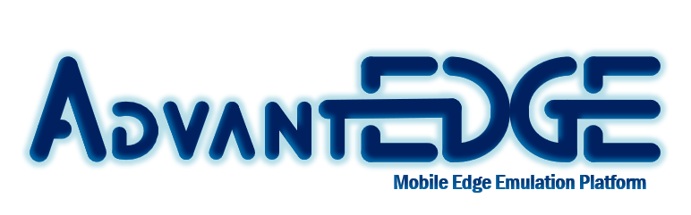

AdvantEDGE is a Multi-Access Edge Emulation Platform (MEEP) that runs on Docker & Kubernetes

> MEEP provides an environment to experiment with Mobile Edge Computing (MEC) technologies and edge / fog deployment models in short and agile iterations.

## Motivations
- [x] **Accelerate Mobile Edge Computing adoption**
- [x] **Discover new edge application use cases & services**
- [x] **Answer these questions:**
  * Where should my application components be located in the network?
  * What are network characteristics limitations of my application?
  * How will my application behave when the user moves in the network?

## Getting started
* [Setup runtime environment (Ubuntu/Dockers/Kubernetes/Helm)](docs/setup_runtime.md)

* Setup [*meepctl*](docs/meepctl/meepctl.md) tool
  * Copy to an executable path 
    `sudo cp ~/AdvantEDGE/bin/meepctl/meepctl /usr/local/bin/`
  * Configure 
  `meepctl config set --ip <your-node-ip> --gitdir <path-to-advantedge-git-dir>`

* [Deploy AdvantEDGE](docs/deploy.md)

* [Use AdvantEDGE](docs/use.md)

## Concepts
The following AdvantEDGE concepts are described [here](docs/concepts.md)
- [x] Micro-service Architecture
- [x] Macro-network Model
- [x] Network characteristics
- [x] Network mobility
- [x] External UE support

## Developing (**_Work In Progress_**)
* [Setup build environment (go/dep/...)](docs/setup_build.md)

* [Build AdvantEDGE](docs/build.md)

* [Test AdvantEDGE](docs/test.md)

_Code Distribution (DevWorkflow, APIs, Build, Test, Coding standard, files)_
## Contributing (**_Work In Progress_**)
_How to contribute_
## Licensing (**_Work In Progress_**)
_Licensing information_
