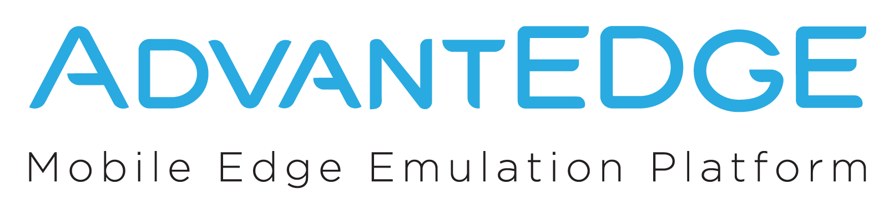

AdvantEDGE is a Mobile Edge Emulation Platform (MEEP) that runs on Docker & Kubernetes.

> AdvantEDGE provides an emulation environment, enabling experimentation with Edge Computing Technologies, Applications, and Services.  The platform facilitates users to explore edge / fog deployment models and their impact to applications and services in short and agile iterations.

## Motivation

- [x] **Accelerate Mobile Edge Computing adoption**
- [x] **Discover new edge application use cases & services**
- [x] **Help to answer questions such as:**
  - Where should my application components be located in the edge network?
  - How do network characteristics (such as latency, jitter, and packet loss) impact my application or service?
  - How will my application behave when the user moves within and across access networks?

## Intended Users

- [x] **Edge Application Developers**
- [x] **Edge Network and Service Designers**
- [x] **Edge Researchers**
- [x] **Technologists that are simply interestied learning how the Edge works**

## Concepts

An understanding of some AdvantEDGE concepts is helpful towards effectively using the platform and understanding how it works.

Before getting started we recommend familiarity with key [AdvantEDGE concepts](docs/concepts.md)

## Getting started

- [Setup runtime environment (Ubuntu/Dockers/Kubernetes/Helm)](docs/setup_runtime.md)

- Clone the AdvantEDGE repo
  ```
  git clone https://github.com/<your-fork>/AdvantEDGE.git
  ```
  > **Note:** Assumes local gitdir = `~/AdvantEDGE`

- Obtain AdvantEDGE binaries
  - [Build from source](#building)
  - Optionally use pre-built binaries (from GitHub release)
    ```
    # Get bin folder tarball from desired release
    cd ~/AdvantEDGE
    tar -zxvf advantedge.<version>.linux-amd64.tar.gz
    ```

- Setup [*meepctl*](docs/meepctl/meepctl.md) tool
  - Copy to an executable path
    ```
    sudo cp ~/AdvantEDGE/bin/meepctl/meepctl /usr/local/bin/
    ```
  - Configure
    ```
    meepctl config set --ip <your-node-ip> --gitdir /home/<user>/AdvantEDGE
    ```

- [Deploy AdvantEDGE](docs/deploy.md)

- [Use AdvantEDGE](docs/use.md)

## Building

- [Setup development environment (Ubuntu/Go/Node.js/NPM/Linters)](docs/setup_dev.md)

- Clone the AdvantEDGE repo<br>
  `git clone https://github.com/<your-fork>/AdvantEDGE.git`<br>
  (*assuming local gitdir =* `~/AdvantEDGE`)

- [Build AdvantEDGE](docs/build.md)

## Testing

The AdvantEDGE platform test procedures are described [here](docs/testing.md)

## Upstream communication

We use GitHub issues.

So just open an issue in the repo to provide user feedback, report software bugs or request enhancements.

## Licensing

Currently licensed under the *AdvantEDGE Limited Evaluation and Use License Agreement*
