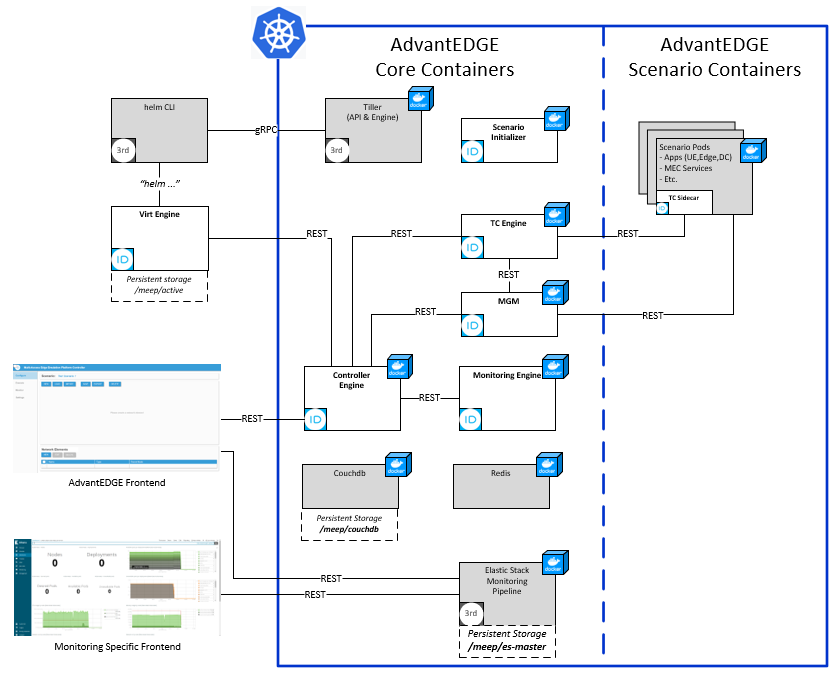
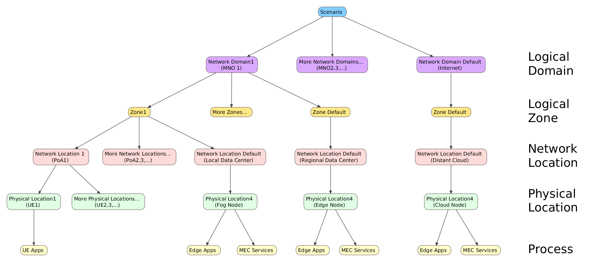

# AdvantEDGE Concepts
## Goal
- [Define micro-service architecture](#micro-service-architecture)
- [Define macro-network model](#macro-network-model)
- [Define network characteristics](#network-characteristics)
- [Define network mobility](#network-mobility)
- [Define external UE support](#external-ue-support)

## Micro-service architecture
AdvantEDGE is a controller software that facillitates deployment of edge applications in a simulated network environment.

It is composed of a collection of micro-services that interact together to allow deployment and testing of edge scenarios.

AdvantEDGE micro-services are packaged in Docker containers which are designed to operate in a Kubernetes environment.

> _AdvantEDGE currently only supports single node K8s host deployment_

Containers belong to one of 3 types

Type | Description
---------|------------
_Core_   | micro-services implementing the AdvantEDGE controller functionality
_Dependency_ | 3rd party micro-services upon which the Core micro-services depends
_Scenario_ | containers implementing an edge application use case

High-level overview of AdvantEDGE micro-service architecture

AdvantEDGE components have the following roles:

Component |Type| Role
---------|------------|------------
_Controller Engine_ |core| Orchestrate interactions between the user (GUI) and other micro-services
_Virtualization Engine_ |core| Deploy/Delete scenario containers
_Scenario Initializer_ |core| Dynamically modify scenario containers at deployment time
_Monitoring Engine_ |core| Monitor the state of core and scenario containers
_Traffic Controller Engine_ |core| Orchestrate application of network characteristics to the scenario containers
_Traffic Controller Sidecar_ |core| Apply location specific network characteristics to a scenario container. Sidecar is dynamically injected into scenario pods at deployment time
_Mobility Group Manager_ |core| Orchestrate edge application state relocation
_Couchdb_ |dep.| Store user scenarios
_Helm CLI + Tiller_ | dep.| Deploy K8s containers
_Redis_ | dep. | Store internal runtime data
_Elastic Stack_ | dep. | Monitoring pipeline

## Macro-network model
AdvantEDGE uses the following model to define a scenario.

Layer | Description
---------|------------
_Scenario_ | Scenario is the top level component of the Macro-network model   <li>AdvantEDGE users creates scenarios <li>AdvantEDGE can store multiple scenarios <li>Each scenario is uniquely named <li> One scenario is deployed at a time (e.g. the "active" scenario)
_Logical Domain_ | Defines the number and types of domains within a scenario   <li>Internet/Distant cloud is the default domain <li> Each MNO represents a domain <li>Scenario layer defines Inter-Domain network characteristics for traffic crossing between domains
_Logical Zone_ | A domain can be decomposed in different zones   <li>Zones allow to group multiple Network locations together <li>Logical Domain layer defines Inter-Zone network characteristics for traffic crossing between zones
_Network Location_ | Defines locations within a zone where nodes attach to the network   <li>Also referred to as a Point of Attachment (PoA) <li>PoA may connect Fixed or Mobile terminals (e.g. edge/fog/cloud nodes, int./ext. UEs) <li>Logical Zone layer defines Inter-Fog, Inter-Edge & Edge-Fog network characteristics for traffic crossing between these network locations
_Physical Location_ | Defines the physical location of a device; each device in a system occupies its own unique physical location   <li>Defines the node type that occupies the physical location <li>Example of node types are edge,fog,cloud,internal UE, external UE <li>Mobile terminals may dynamically be changed of PoA at scenario runtime by sending a Mobility Event <li>Network Location layer defines the terminal link network characteristics
_Process_ | The "leaf" of the model tree; process represents an application executing at a specific Physical Location   <li>Each process is realized by deploying a container in K8s <li>Process are impacted by network characteristics as described [here](#network-characteristics) <li>External UEs have their process running outside of the AdvantEDGE platform as described [here](#external-ue-support)

## Network Characteristics
AdvantEDGE supports the following network characteristics: latency, jitter, throughput and packet loss

Characteristic | Description
---------|------------
_Latency_ | Amount of time that a packet takes to traverse a network to its final destination   <li>Expressed in milliseconds <li>In order to simplify scenario definition, AdvantEDGE uses a latency model; given a scenario with N nodes, a user therefore does not have to specify N x (N-1) latencies <li> Latency model has the following configuration points: Inter-Domain, Inter-Zones, Inter-Edge, Inter-Fog, Edge-Fog and Terminal Link <li>Latency experienced is the sum of latencies between the source and destination nodes   _NOTE: Latency is applied to **every** packet crossing the network regardless of direction; for example, each packet of the TCP Three-Way Handshake is equally affected when establishing a TCP connection (e.g. a total latency of 10ms betweeen 2 nodes =  30ms TCP session establishment time)_
_Jitter_ | Variation of the latency parameter   <li>Expressed as a percentage <li>Each latency in the model has its own jitter value
_Throughput_ | Maximum amount of data moved between two points in the network   <li>Expressed in Megabits per seconds (Mbps) <li>Throughput has the same configuration points as Latency <li>Throughput experienced between two nodes equals the minimum throughput observed on the data path    _Limitation: Currently, throughput caps the maximum throughput between 2 nodes and does not take into account the data generated by other nodes. For example, an Inter-Zone throughput capped at 1 Mbps may effectively have 2 Mbps of traffic if two different nodes transmits data across zones; each node would be capped at 1Mbps._
_Packet Loss_ | Packet loss occurs when data packets travelling acrossthe network fail to reach their destination   <li>Expressed as a percentage <li>Packet Loss has the same configuration points as Latency <li>Packet Loss experienced between two nodes equals the maximum packet loss observed on the data path

## Network Mobility
AdvantEDGE implements an API that allows to trigger Network Mobility events.

With regards to the AdvantEDGE model, a network mobility event represents a Physical Location (e.g. a UE terminal) that changes its parent Network Locatioexternaln (e.g. a PoA). When such an event happens, the network characteristics affecting the moved UE are re-calculated by AdvantEDGE.

Mobility events are sent via the AdvantEDGE REST API and can be manually triggered from the AdvantEDGE frontend or alternatively trigerred by an experimenter's specific application.

## External UE support
AdvantEDGE supports experimenting with UEs external to the platform.

One of the complexities of supporting external UEs is applying network characteristics to these external nodes as if they were present on the simulation platform.

To enable this use case, AdvantEDGE needs to create a K8s pod that runs on the platform for **each** external UE. External UE then needs to access internal services (edge/fog/distant cloud) by going through their respective shadowing pod. This makes it possible for AdvantEDGE to track an external UE location through the network and to apply the required network characteristics to that UE.
