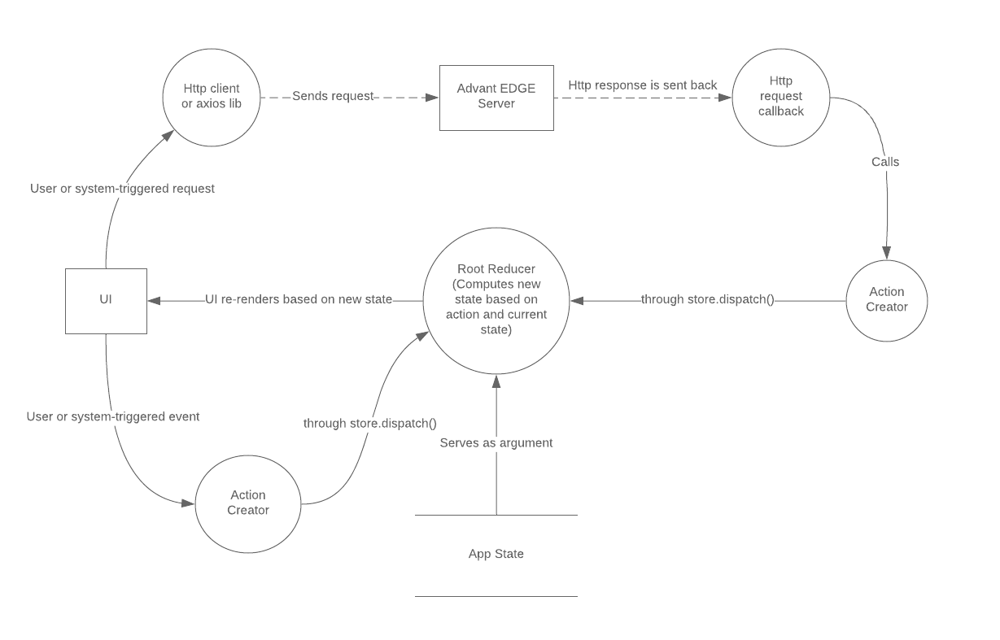

# Frontend structure and main concepts

## Introduction
 
This document aims at providing a bird's eye view of the internals of the *_AdvantEDGE_* web frontend. The state of the application is briefly described and then the mechanism by which it is changed is outlined. This high-level overview should give the reader enough insight into the design choices to get started exploring and augmenting it.

The frontend has been implemented with the _React_ and _Redux_ javascript libraries and it is recommended that the reader be familiar with them.

Please take some time to read on [_React_](https://reactjs.org/docs/getting-started.html) and [_Redux_](https://redux.js.org/) libraries as needed.


## Overview
The frontend consists of 4 main tabs or pages:

Page | functionalities
----------- | ------------
Config      | <li>Scenario creation <li>Updating a scenario <li>Exporting <li> Importing a scenario
Execution   | <li> Scenario deployment <li>Mobility events <li>Network Characteristics updates
Monitor     | Monitoring dashboards
Settings    | General parameters e.g. automatic scenario refresh

For more details on concepts mentioned in the above table please refer to [AdvantEDGE concepts](https://github.com/idcc-dev/AdvantEDGE/blob/master/docs/concepts.md)

The state of the application has fields for the configuration, Execution and Settings page and also has a ```ui``` field which describes some high-level states of the UI, such as which page the user is curently on, among others.

The application state has the following structure:

 ``` Javascript
 {
    ui: {
        page: ...,
        eventCreationMode: true | false,
        currentEventType: UE_MOBILITY_EVENT | NETWORK_CHARACTERISICS_EVENT,
        devMode: true | false,
        automaticRefresh: true | false,
        refreshInterval: <in ms>,
        execShowApps: true | false
    },
    cfg: {
        type: {...},
        state: {...}
        scenario: {...} 
        vis: {...} 
        table: {...}
        elementConfiguration: {...}
        apiResults: {...}
     },
     exec: {
        type: {...}
        state: {...}
        scenario: {...}
        vis: {...}
        table: {...}
        selectedScenarioElement: {...}
        apiResults: {...}
     },
     settings: {
         ...
     },
 }
 ```

The following table describes the role of some of the paths in the `ui` part of the application state.

Path                     | Description
-------------------------|--------
`ui.page`                | The current selected page (`cfg`, `exec`, etc.) 
`ui.eventCreationMode`   | Says whether the creation pane is open
`ui.automaticRefresh`    | If `true` the scenario is refreshed periodically
`ui.refreshInterval`     | Interval at which the scenario is refreshed. Min is 500 ms
`ui.execShowApps`        | If apps are shown or not in the network visualization of the exec page.

The same for the `cfg` part of the state:

Path           | Description
---------------| --------------
`cfg.state`    | Whether a scenario is opened or not
`cfg.scenario` | The currently opened scenario in the config page
`cfg.vis`      | The data needed for the network visualization on the config page
`cfg.table`    | The data structure representing the working copy of the loaded scenario
`cfg.elementConfiguration.configuredElement` | The network element currently being worked on (creation, update etc.)
`cfg.apiResults`| Results of some api calls. _i.e._ available scenario to load etc.

The table for the `exec` part is similar but applies to the case of a deployed and running scenario:

Path           | Description
---------------|---------------
`exec.state`   | Says whether a scenarion is deployed or if the system is idle i.e. no scenario currently deployed.
`exec.state`   | The scenario that is currently deployed i.e. 'active'
`exec.table`   | The data structure representing the workable copy of the deployed scenario
`exec.selectedElement` | The currently selected network element in the deployed scenario along with it's network characteristics.
`exec.apiResults` | Results of some api calls.

The `settings` part of the state currently only has a boolean value named `settings.devMode`. In dev mode it is possible to play with some parameters of the visualization tool such as physics properties used in graph representation.


### Reducers
A _Redux_ application uses a special function called the _reducer_. It is often referred to as the _Root Reducer_ as in many apps it is composed from smaller reducer functions performing a similar task but on parts of the state only.

In general a _redux_ reducer function is a '_pure function_', that is, has no side-effects. It takes as its arguments an `action` and the current `state` of the application and computes a new state for the application. In turn, the main functionality of _React_ can be seen as a function that takes the `state` and through a `render` function outputs corresponding html markup. 

In the case of the _AdvantEDGE_ application, the root reducer is composed from more specialized reducers that individually compute state transistions for the following branches of the state tree: 
 `ui`, `cfg`, `exec` and `settings`.  In turn, `cfg` and `exec` are each created by combining lower-level reducers, one for each sub-branch of the state.


Please refer to the documentation on [Redux](https://redux.js.org/)  and [_React_](https://reactjs.org/docs/getting-started.html) for a more in depth explanation.

### Actions

The state of the application is updated through Redux _actions_ when user-initiated events occur or following responses from HTTP requests to the AdvantEDGE server.

The following diagram illustrates this general pattern as used in the _AdvantEDGE_ frontend.

 

 Here are some of the actions that are used in the implementation of the _AdvantEDGE_ application.

 State Path          | Action Name          | Description
 --------------------|----------------------|--------------
`ui.page`            | `CHANGE_CURRENT_PAGE`| Will result in the specified page being shown to the user. It can be one of the 4 pages or tabs: `cfg`, `exec`, `monitor` or `settings`
`ui.currentDialog`   | `UI_CHANGE_CURRENT_DIALOG` | This is how, through an action, a modal dialog is shown to the user. Which dialog to show is specified in the payload of the action.
`cfg.elementConfiguration.configuredElement` | `CFG_ELEM_NEW` | Triggered when the user wants to add a new element to the scenario being worked on.
`cfg.elementConfiguration.configuredElement` | `CFG_ELEM_UPDATE` | Triggered when the user wants to update an element in the scenario being worked on.
`exec.table`         | `EXEC_CHANGE_TABLE`   | When triggered, the data representing the working copy of the deployed scenario is modified.
`exec.state.corePodsPhases` | `EXEC_CHANGE_CORE_PODS_PHASES` | Triggered periodically as the state of core pods is polled from the server. This affects the  system status led at the top right corner of the app frontend.

  


