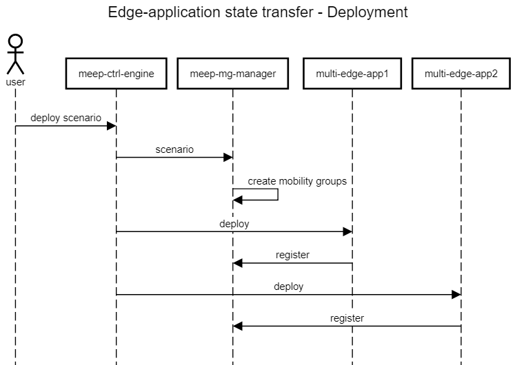
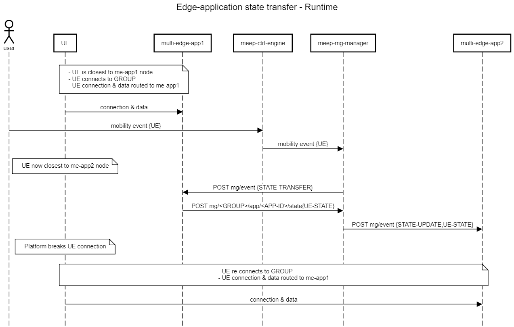

# Edge Applications State Transfer
AdventEDGE provides a state transfer service that facilitates UE state transfer between instances of a multi-edge group.

To use the state transfer service, multi-edge applications have to:
1. register to the service Mobility Group (MG)
1. implement a minimal predefined REST API
> *Note  MG Group(s) are created by the AdvantEDGE platform at scenario deployment time, based on the multi-edge group(s) defined in the scenario*

MG manager then interacts with the multi-edge application instances to instruct when a state transfer is needed.

The multi-edge application can then transfer the state through the MG Manager.

The following figure presents an overview of the sequence at scenario deployment time.

- On scenario deployment, mg-manager creates the mobility groups
- meep-ctrl-engine (through the virt-engine) then deploys the multi-edge applications
- upon start-up, multi-edge applications register to the mg-manager

The following figure presents an overview of the sequence at scenario runtime.

- At connection time, UE traffic is routed to the closest multi-edge application instances (me-app1 node)
- A mobility event is trigerred and the UE moves closer to me-app2 node
- mg-manager is informed of the UE movement and triggers a STATE-TRANSFER event towards me-app1
- me-app1 provides back the UE state to the mg-manager which in turns sends it to the me-app closest to the UE (me-app2)
- UE connection is broken forcing the UE to re-connect; UE traffic is routed to the closest multi-edge application isntance which is now me-app2
