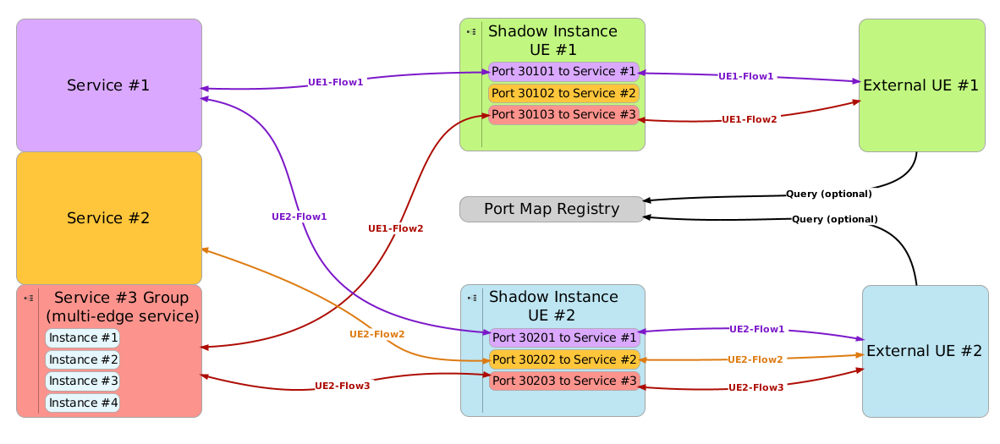

# Using an External UE
AdvantEDGE implements a solution that allows external physical UEs to interact
with internal services as if they were internal to the platform.

External UEs have almost the same capabilities as UEs residing inside the platform.
They have a network localization that can be changed as they move and they experience network characteristics based on their location.

In order to apply network characteristics to an external UE, AdvantEDGE implements the following strategy: allocate a *"shadow instance"* inside the platform for each external UE which re-directs it to the final destination.

Using that approach, an external UE simply has to send its traffic to the corresponding shadow instance which takes care of applying network characteristics.

### Port Mapping
Since AdvantEDGE components are co-located on a single physical platform, services exposed externally all share the same IP address. Services are therefore exposed  externally on different port numbers. This imposes some port management for the scenario designer.

As shown on the following figure, this requires to expose a port for every service that an external UE will access. These ports are statically configured by the scenario designer at scenario creation time.

To help the user with port mapping management, AdvantEDGE provides two features to users:
  1. Dynamic port map in the frontend 
  In the execute tab, when a scenario is deployed, the port map of every external UE is shown. This is useful for use cases when external UEs need to be configured manually by a user. 

  1. Port Map Registry 
  For use cases where external UE can be configured programatically, AdvantEDGE platform provides a REST API that allows to query the port number that an external UE should be using to access a specific service. What we typically do is simply make a REST GET call to the registry from the UE software prior to connecting to the service; this method makes port management seamless even when port values are changed in the scenario.
